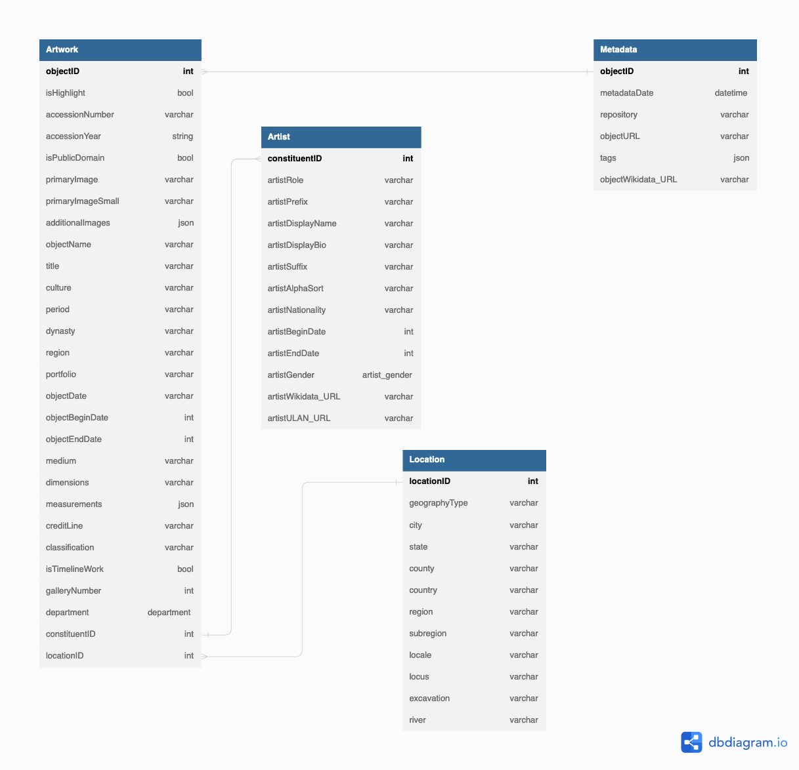

# CIS 550 Project Outline

## Table of content

1. Motivation for the idea/description of the problem the application solves
2. List of features you will definitely implement in the application.
3. List of features you might implement in the application, given enough time
4. List of pages the application will have and a 1-2 sentence description of each page. We expect that the functionality of each page will be meaningfully different than the functionality of the other pages.
5. Relational schema as an ER diagram.
6. SQL DDL for creating the database.
7. Explanation of how you will clean and pre-process the data.
8. List of technologies you will use. You must use some kind of SQL database. We recommend using MySQL or Oracle specifically because you will use MySQL in HW2, and we will provide guidance for setting up a MySQL database. Some groups in the past have had issues with MySQL, but Oracle is another option.

## 1. Motivation for the idea/description of the problem the application solves. 

Museums are essential for education, but not everyone can visit them in person. That's why we're building the Met Collection Application, which will house almost all of the Met's artifacts. This platform will enable users to enjoy a vast range of stunning artwork, from carvings to paintings to wood, all while being able to categorize these pieces based on their unique characteristics. 

By making art more accessible, we hope to promote education and cultural understanding, positively impacting people's lives. We're excited to be creating a tool that will make art and culture more widely available,  and we look forward to its positive impact on the world of art and education.

## 2. List of features you will definitely implement in the application

- **Feature #1**: A overview page with some highlighting artifacts cards
- **Feature #2**: A search bar to search the artifact based on its name("title")
- **Feature #3**: A detailed page that shows the details of the specific artifact
- **Feature #4**: A Recommending system that gives you the most relevant artifact you want to see.

## 3. List of features you might implement in the application, giving enough time. 

- The classification page that provides a collection of artifacts and some articles for educational purposes. 
-  The artist page that provides detailed artist information.
- The popular exhibition that provides the info of the most recent exhibition in Met.

## 4. List of pages the application will have and a 1-2 sentence description of each page. We expect that the functionality of each page will be meaningfully different than the functionality of the other pages.

- **Home page**: an overview of Met's most highlighting artifacts and departments.
- **Search/Filter page**: a search page that can search the artifacts based on name with the filtering function to filter what the user wants.
- **Detail Page**: a display of full detail about the specific artifact, with the recommended artifacts. 
- **Department Page**: a display of the collection in the specific department. 

## 5. ER diagram 

## 6. SQL DDL for creating the database

- **Artwork**(<u>objectID</u>, isHightlight, accessionNumber, accessionYear, isPublicDomain, primaryImage, primaryImageSmall, additionalImages, objectName, title, culture, period, dynasty, region, profolio, objectDate, objectBeginDate, medium, dimensions, measurements, creditLine, classification, isTimelineWork, GalleryNumber, department, constituenID, locationID)
- **Artist**(<u>constituentID</u>, artistRole, artistPrefix, artistDisplayName, artistDisplayName, artistDisplayBio, artistSuffix, artistAlphaSort, artistNationality, artistBeginDate, artistEndDate, artistGender, artistWikidata_URL, artistULAN_URL)
- **Location**(<u>locationID</u>, geographyType, city, state, county, country, region, subregion, locale, locus, excavation, river)
- **Metadata**(<u>objectID</u>, rightsAndReproduction, linkResource, metadataDate, repository, objectURL, tags, objectWikidata_URL)

## 7. Explanation of how you will clean and pre-process the data

1. Use the multi-threading programming to fetch each object with the API and store it into a big CSV file, which holds all information, filtering it if `primaryImage` or `primaryImageSmall` is NULL.

2. Split the big CSV file into several small CSV files based on the Table schema we use. 

3. Remove the duplicates in the table Artists and Location, and create the `constituentID` and `locationID` 

4. Further cleaning to remove the vital value which should not be NULL.

    

##  8. List of technologies you will use

- Front-end: React.js
- Back-end: Express.js, Node.js
- Database: MySQL & MongoDB hosted on AWS
- Data processing: Python(pandas)

## 9. Description of what each group member will be responsible for

